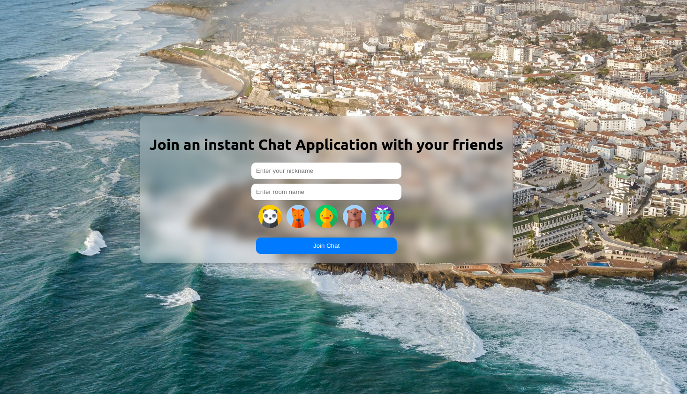

# Chat Application

This project is a chat application with a React.js frontend and a Python WebSocket backend. The application allows users to join different chat rooms, choose a nickname, select an avatar, and send messages to other users in the same room. Additionally, it includes DNS resolution functionality.

## Features

- Users can join different chat rooms.
- Users can set their nicknames and choose avatars.
- Real-time message broadcasting within rooms.
- DNS resolution via the chat interface.
- WebSocket server for real-time communication using Python and `websockets` library.
- Logging functionality in both frontend and backend.
- Code quality checks using `pylint` and `black`.
- Husky configured to run code quality checks on commit.

## Screenshots

### Chat Interface


### Join Room



## Setup and Installation

### Prerequisites

- Node.js and npm
- Python 3.8 or higher
- `virtualenv` (optional but recommended)
- Visual Studio Code (VSCode)

### Backend Setup

1. **Clone the repository:**

    ```bash
    git clone https://github.com/Kalyani02072003/Chat-Application.git
    cd Chat-Application
    ```

2. **Set up a virtual environment and activate it:**

    ```bash
    python -m venv venv
    source venv/bin/activate  # On Windows use `venv\Scripts\activate`
    ```

3. **Install the required Python packages:**

    ```bash
    pip install -r requirements.txt
    ```

4. **Run the WebSocket server:**

    ```bash
    python chat_server.py
    ```

### Frontend Setup

1. **Navigate to the `frontend` directory:**

    ```bash
    cd chat-app
    ```

2. **Install the required npm packages:**

    ```bash
    npm install
    ```

3. **Run the React application:**

    ```bash
    npm start
    ```

### Visual Studio Code Setup

1. **Open the project in VSCode:**

    ```bash
    code .
    ```

2. **Install the following VSCode extensions:**

    - Python
    - ESLint

### Husky Setup

1. **Install Husky and configure git hooks:**

    ```bash
    npx husky install
    ```

2. **Add a pre-commit hook:**

    ```bash
    npx husky add .husky/pre-commit "npx eslint . && npx prettier --check . && pylint chat_server.py && black --check ."
    ```

## Code Quality

The code quality is maintained using the following tools:

- **pylint:** Linter for Python code.
- **black:** Code formatter for Python.
- **ESLint:** Linter for JavaScript code.

### Running Code Quality Checks

1. **Python Code Quality:**

    ```bash
    pylint chat_server.py
    black chat_server.py --check
    ```

2. **JavaScript Code Quality:**

    ```bash
    npx eslint .
    ```

### Objectives

1. **Python Development Environment Setup:**

    - The project uses a virtual environment (`venv`) and installs dependencies from `requirements.txt`.
    - `pylint` and `black` are used to maintain code quality.

2. **Networking Application:**

    - The application includes a WebSocket server (`chat_server.py`) that handles client connections, room management, and DNS resolution.

3. **DNS Resolution and IP Echo:**

    - The server performs DNS resolution using the `dns.resolver` module.
    - The WebSocket server echoes IP addresses resolved from DNS queries back to the client.

4. **Logging Functionality:**

    - Logging is implemented in both the frontend and backend for easier debugging and monitoring.

5. **Husky Configuration:**

    - Husky is configured to run `eslint`, `pylint`, and `black` on commit to ensure code quality.

